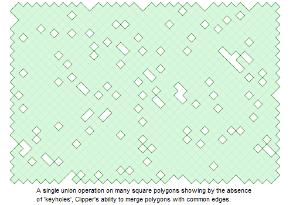

### **Clipper.Execute**

```
Del.»
function Execute(clipType: TClipType;
  out solution: TPaths;
  subjFillType: TPolyFillType = pftEvenOdd;
  clipFillType: TPolyFillType = pftEvenOdd): boolean; overload;

function Execute(clipType: TClipType;
  out solution: TPolyTree;
  subjFillType: TPolyFillType = pftEvenOdd;
  clipFillType: TPolyFillType = pftEvenOdd): boolean; overload;

C++ »
bool Execute(ClipType clipType,
  Paths &solution,
  PolyFillType subjFillType = pftEvenOdd,
  PolyFillType clipFillType = pftEvenOdd);

bool Execute(ClipType clipType,
  PolyTree &solution,
  PolyFillType subjFillType = pftEvenOdd,
  PolyFillType clipFillType = pftEvenOdd);

C#  »
public bool Execute(ClipType clipType,
  Paths solution,
  PolyFillType subjFillType,
  PolyFillType clipFillType);

public bool Execute(ClipType clipType,
  PolyTree solution,
  PolyFillType subjFillType,
  PolyFillType clipFillType);
```

一旦裁剪路径组和被裁剪路径组已经被设定（通过AddPath或者AddPaths方法）,**Execute**方法可以执行布尔运算，具体运算类型由clipType来指定；
最终的solution参数可以是一个路径组（Path）或者一个多边形树（PolyTree）类型。因为路径组结构比多边形树结构简单，所以效率相对较高（大约10%）；但是，PolyTree的信息结构可能提供给了用户更多的有用信息。首先，PolyTree结构保留了网状的多边形父子关系（例如外轮廓包含孔洞、孔洞包含内轮廓等）。相同的，只有PolyTree类型可以区别开轮廓和闭合轮廓，因为每一个PolyNode结构有IsOpen的属性（Path类型没有任何成员来告知它是否为开放的或者是闭合的）。正因为如此，当一个开放轮廓组被传递给一个Clipper对象，使用者必须使用一个PolyTree类型来接收solution的结果，否则会引起错误；
当在使用开放式路径进行裁剪时，Clipper库提供了两个有效的函数来快速的分离结果当中的开放路径部分和闭合轮廓组部分OpenPathsFromPolyTree和CLosedPathsFromPolyTree。同时Clipper也提供了PolyTreeToPaths来快速将PolyTree类型转换为Paths。



关于solution返回的路径组，有以下几点需要注意：
> - 并没有固定的顺序；   
> - 不会出现叠加和自交的情况；   
> - 内孔的方向永远会和外孔相反；   
> - solution的填充类型可以认为是Odd-Even或者Non-Zero中的任意一种，即兼容这两种填充方式；   
> - 多边形该很低概率的情况下会分享一个共同的变（在版本6.0之后该情况变得非常少有）；     

被填充图形填充类型(subjFillType)和裁剪图形填充类型(clipFillType)决定了多边形的填充规则和相对规则；
Execute可以执行多次，不需要重置，即可以对一个多边形进行多次Execute的处理；