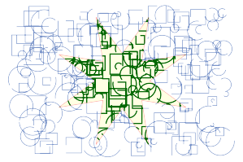

### **ClipperBase.AddPath**

```
Del.» function AddPath(const path: TPath; polyType: TPolyType; Closed: Boolean): Boolean;

C++ » bool AddPath(const Path &pg, PolyType polyType, bool closed);

C#  » public virtual bool AddPath(Path pg, PolyType polyType, bool closed);
```


任何数量的实体路径和剪切路径都可以被添加到一个AddPath()方法中去，或者通过AddPaths()来实现添加到一个组当中去，或者两者混用；
实体路径可以是开线段集或者闭合线段；但是裁剪线段必须是~~闭合的~~.
在闭合的路径当中，==方向问题==应当结合filling rule来进行考虑，并且是通过Clipper库中的excecute()方法来传递的；

路径的坐标范围：类似前文中IntPoint中范围

返回值内容：如果输入的路径不正确，该函数会返回false；在以下情况路径会被视为不正确：
- 该路径少于两个点；
- 有两个点但是不是一个开放路径；
- 点集全部是共线的但是不是一个开放路径；