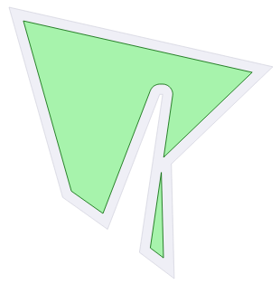

### **ClipperOffset**

ClipperOffset类封装了偏置类的函数（膨胀/收缩），可对开放式轮廓和封闭轮廓进行处理，并支持使用不同的转接类型和终止类型；
（该类替代了原来的OffsetPath功能，提供了更大的灵活性）
偏置的先决条件：
1. 闭合路径的方向必须是一致的，即所有外轮廓的方向相同，而所有内轮廓方向相反（除了None-Zero填充方法）。所有开轮廓必须和封闭外轮廓方向相同；
2. 多边形一定不能自交；

限制：
在偏置时，小的人为物块可能会在多边形交叠的地方出现。为了防止这类情况的发生，可以对多边形组内容进行单独的偏置处理；

```
#include "clipper.hpp"  
...
using namespace ClipperLib;
 
int main()
{
  Path subj;
  Paths solution;
  subj << 
    IntPoint(348,257) << IntPoint(364,148) << IntPoint(362,148) << 
    IntPoint(326,241) << IntPoint(295,219) << IntPoint(258,88) << 
    IntPoint(440,129) << IntPoint(370,196) << IntPoint(372,275);
  ClipperOffset co;
  co.AddPath(subj, jtRound, etClosedPolygon);
  co.Execute(solution, -7.0);
   
  //draw solution ...
  DrawPolygons(solution, 0x4000FF00, 0xFF009900);
}
```

