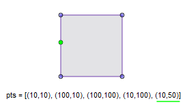
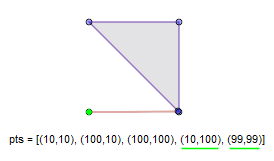

### **CleanPolygons**

```
Del.» function CleanPolygons(const Polys: TPaths; Distance: double = 1.415): TPaths;

C++ » void CleanPolygons(const Paths &in_polys, Paths &out_polys, double distance = 1.415);

C++ » void CleanPolygons(Paths &polys, double distance = 1.415);

C#  » public static Paths CleanPolygons(Paths polys, double distance = 1.415);
```

主要用来移除以下类型的点集：
> - 连接点共线的边，或者近似共线的边（那么在指定距离内不会存在共线点）；
> - 距离过近的相邻点（在指定范围之内）；
> - 在次相邻的线段以及无关线段之间距离过小（在指定范围之内）；    

次相邻是指两点之间还有一个点（无关点）；
函数中的distance默认值为√2，所以轮廓上每个点如果在X或者Y方向上与相邻点或者次相邻点之间的距离小于1个单位的点将会被去除。（如果相邻边也是与无关点次相邻也会被移除）。
C++限定：该函数被冲在。在第一种定义中，in_poly和out_poly可以指同一个路径，来防止进入到第二种重载会自动清除Path中的内容（第二种是指Paths）；

